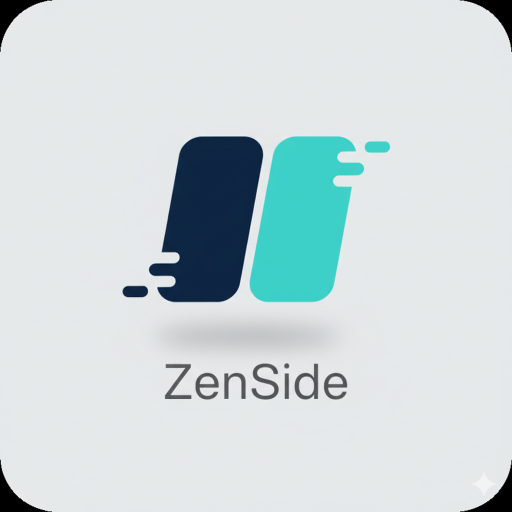

# ZenSide

A dual-purpose macOS side panel combining note-taking (ZenNote) and personal finance tracking (ZenCash) into one elegant utility.

[](https://claude.ai/claude-code)
[](https://opensource.org/licenses/MIT)
[](https://github.com/zenbytes-id/zenside/releases)



## Features

### Note-Taking (ZenNote)
- 🎯 Quick access side panel that slides from screen edge
- ⌨️ Global keyboard shortcut (Cmd+Shift+S)
- 📝 Markdown support with WYSIWYG editor
- 📁 Folder organization with nested support
- 🔍 Full-text search across all notes
- 💾 Filesystem sync with Git integration
- 🎨 Color-coded folders and notes

### Personal Finance (ZenCash)
- 💰 Multiple pockets (accounts) for money management
- 📊 Track income, expenses, and transfers
- 🏷️ Customizable categories with icons and colors
- 📈 Monthly summaries and balance tracking
- 💾 JSON-based storage with sync support

### General
- 🌓 Runs in menu bar (no dock icon)
- 🖱️ Hot bar for quick access from screen edge
- 🔄 Git integration for version control
- 🎨 Clean, minimal interface
- ⚡ Fast and lightweight

## Installation

### Download

Download the latest release from [GitHub Releases](https://github.com/zenbytes-id/zenside/releases)

**Available formats:**
- `.dmg` - Drag and drop installer (Recommended)
- `.zip` - Portable application

### Build from Source

```bash
# Clone the repository
git clone https://github.com/zenbytes-id/zenside.git
cd zenside

# Install dependencies
npm install

# Run in development mode
npm start

# Build for production
npm run make
```

## Usage

1. **Launch ZenSide** - Click the menu bar icon or press `Cmd+Shift+S`
2. **Quick Access** - Hover near the left edge of your screen to show the hot bar
3. **Create Notes** - Click the hot bar or use the keyboard shortcut
4. **Organize** - Create folders and organize your notes

### Keyboard Shortcuts

- `Cmd+Shift+S` - Toggle panel visibility
- `Cmd+F` - Open search (shows panel if hidden)
- Menu bar → Quit - Exit application

## Development

```bash
# Install dependencies
npm install

# Start development server
npm start

# Package application
npm run package

# Create distributable
npm run make

# Lint code
npm run lint
```

## Building for Distribution

### Code Signing (macOS)

To distribute ZenSide, you'll need an Apple Developer account and code signing certificate.

See [docs/APPLE_CODE_SIGNING.md](docs/APPLE_CODE_SIGNING.md) for detailed setup instructions.

**Quick setup:**
```bash
cp .env.example .env
# Edit .env with your Apple Developer credentials
./build-release.sh
```

This will create signed and notarized `.dmg` and `.zip` files in `out/make/`.

For development builds without signing:
```bash
npm run package:fast
npm run make:fast
```

## Project Structure

```
zenside/
├── src/
│   ├── main.ts              # Electron main process
│   ├── renderer.tsx         # React entry point
│   ├── App.tsx              # Main React component
│   ├── preload.js           # IPC bridge
│   ├── components/          # React components
│   ├── services/            # Core services (filesystem, git, finance)
│   ├── hooks/               # Custom React hooks
│   ├── utils/               # Utility functions
│   └── types/               # TypeScript type definitions
├── assets/
│   ├── zenside.icns         # App icon
│   ├── note.png             # Menu bar icon
│   └── favicon_io/          # Web icons
├── docs/                    # Documentation
└── forge.config.js          # Electron Forge config
```

## Configuration

### Icon Files

- **App Icon**: `assets/zenside.icns` - Main application icon (multiple resolutions)
- **Menu Bar**: `assets/note.png` - Simple monochrome icon for macOS menu bar

### Build Configuration

Edit `forge.config.js` to customize:
- App icon
- Bundle ID
- Package settings
- DMG appearance
- Code signing (for distribution)

## Contributing

Contributions are welcome! Please read [CONTRIBUTING.md](CONTRIBUTING.md) for guidelines on how to contribute to this project.

## License

MIT License - see [LICENSE](LICENSE) file for details

## Credits

**Created with AI:**
- Built using [Claude Code](https://claude.ai/claude-code) by Anthropic
- AI-assisted development and architecture

**Technology Stack:**
- [Electron](https://www.electronjs.org/)
- [React](https://react.dev/)
- [TypeScript](https://www.typescriptlang.org/)
- [Electron Forge](https://www.electronforge.io/)

## Support

- Website: [zenside.zenapps.cloud](https://zenside.zenapps.cloud)
- Issues: [GitHub Issues](https://github.com/zenbytes-id/zenside/issues)
- Email: dev@zenbytes.id

---

Made with ❤️ by [Zenbytes](https://zenbytes.id)
